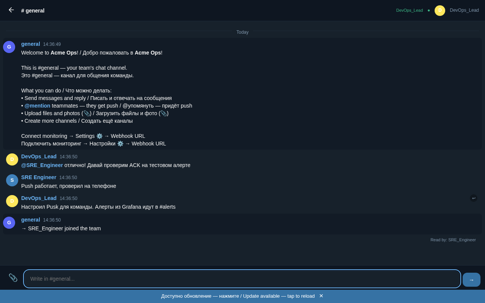

[](https://github.com/getpusk/pusk/releases)
[](https://github.com/getpusk/pusk/actions/workflows/ci.yml)
[](https://github.com/getpusk/pusk/actions/workflows/ci.yml)
[](https://goreportcard.com/report/github.com/getpusk/pusk)
[](https://go.dev)
[](https://core.telegram.org/bots/api)
[](https://www.sqlite.org)

🌐 [Русский](README.md)


# Pusk — self-hosted alerts for ops teams

**Pusk** — self-hosted alert platform with team coordination. Webhooks from any monitoring, one-click ACK, push to phone. Single binary, zero dependencies.

## Why?

**Problem:** alert fires. Who picked it up? Silence.
- Alerts get lost in group chats among discussions
- No acknowledgment (ACK) — unclear who is handling it
- No escalation — if on-call is asleep, the alert dies
- Data on third-party servers — compliance fails

**Solution — Pusk:**
- Alerts from Grafana, Zabbix, Alertmanager, Uptime Kuma — into dedicated channels
- One-click ACK — automatic silence in Alertmanager
- Push notifications to phone even with browser closed
- Team chat built in — channels, @mentions, file uploads
- Telegram Bot API compatible — existing bots work with a one-line change




## Who is it for

- **DevOps/SRE teams** — monitoring alerts + incident coordination
- **Companies with compliance needs** — data on your server, no external dependencies
- **Anyone who needs autonomy** — works without external dependencies

## Features

| Feature | Description |
|---------|-------------|
| **Alerts** | Webhooks from Alertmanager, Grafana, Zabbix, Uptime Kuma. Color indicators, ACK, automatic silence |
| **Push** | Web Push notifications to phone and desktop (even with browser closed) |
| **Bots** | 13 Telegram Bot API methods. Inline buttons, webhook, long polling |
| **Channels** | Team channels, @mentions with push, reply, pin, editing |
| **Files** | Photos, videos, voice messages, documents — upload and view |
| **Online status** | Real-time online/away usernames, typing indicator |
| **Multi-tenant** | Isolated organizations (separate SQLite per tenant) |
| **Simple** | Single binary (23 MB), SQLite, ~2 MB RAM, 1-second startup |

## Use Cases: connect monitoring in 5 minutes

Ready-to-use docker-compose files — download, run, done:

| Use case | What you get | Time |
|----------|-------------|------|
| [Alertmanager](docs/use-cases.en.md#-alertmanager) | Prometheus → Alertmanager → Pusk, ACK with auto-silence | 5 min |
| [Grafana](docs/use-cases.en.md#-grafana) | Grafana Contact Point → Pusk | 5 min |
| [Zabbix](docs/use-cases.en.md#-zabbix) | Zabbix Media Type → Pusk | 5 min |
| [Uptime Kuma](docs/use-cases.en.md#-uptime-kuma) | Uptime Kuma → Pusk | 3 min |
| [All-in-one](docs/use-cases.en.md#-all-in-one) | Full stack to try everything | 5 min |

**[Go to use cases →](docs/use-cases.en.md)**

## FAQ

<details>
<summary><b>Is this yet another messenger?</b></summary>
No. It is an alert platform with team chat. Closer to PagerDuty and Opsgenie than to Slack — but self-hosted and free.
</details>

<details>
<summary><b>How is it different from PagerDuty?</b></summary>
Self-hosted, free, single binary. No on-call scheduling (yet), but has team chat and Telegram Bot API compatibility.
</details>

<details>
<summary><b>Do I need to install an app?</b></summary>
No. Pusk works in your browser — just open the link. You can add it to your home screen as a PWA icon, but it is optional. Chrome, Firefox, Edge supported.
</details>

<details>
<summary><b>How do phone notifications work?</b></summary>
Via Web Push — a browser standard, like Slack and Discord. Works even when the browser is closed. Great on Android, iOS with Safari 16.4+.
</details>

## Quick start

### Docker (recommended)

```bash
docker run -d --name pusk \
  -p 8443:8443 \
  -v pusk-data:/app/data \
  ghcr.io/getpusk/pusk:latest
```

Open `http://localhost:8443` — register and get started.

### First run

1. First user creates an **organization** — becomes admin
2. Go to Settings → **Invite** — copy the link and share with your team
3. Teammates follow the link, register — and they are in
4. New members are automatically subscribed to all channels

> Assign at least 2 admins so you do not depend on a single person.

### Connect monitoring

#### Alertmanager

```yaml
receivers:
  - name: pusk
    webhook_configs:
      - url: 'https://your-pusk/hook/BOT-TOKEN?format=alertmanager'
```

#### Grafana

Alerting → Contact points → New → Type: **Webhook**
URL: `https://your-pusk/hook/BOT-TOKEN?format=grafana`

#### Zabbix

Administration → Media types → Create: **Webhook**
URL: `https://your-pusk/hook/BOT-TOKEN?format=zabbix`

#### Uptime Kuma

Notifications → Add → Type: **Webhook**
URL: `https://your-pusk/hook/BOT-TOKEN?format=raw&channel=alerts`

#### Any system with curl

```bash
curl -X POST 'https://your-pusk/hook/BOT-TOKEN?format=raw' \
  -H 'Content-Type: application/json' \
  -d '{"status":"down","name":"my-service"}'
```

### From source

```bash
git clone https://github.com/getpusk/pusk.git
cd pusk
go build -o pusk ./cmd/pusk/
./pusk
```

### Docker Compose

```yaml
version: '3'
services:
  pusk:
    image: ghcr.io/getpusk/pusk:latest
    ports:
      - "8443:8443"
    volumes:
      - ./data:/app/data
    environment:
      - PUSK_ADMIN_TOKEN=your-secret
    restart: unless-stopped
```

## Telegram Bot API compatibility

If you already have a Telegram Bot API bot — it works in Pusk with a one-line change:

```python
# Python (aiogram)
bot = Bot(token="TOKEN", base_url="https://your-pusk:8443/bot")

# Python (python-telegram-bot)
app = Application.builder().token(TOKEN).base_url("https://your-pusk:8443/bot").build()
```

```javascript
// Node.js (Telegraf)
bot.telegram.options.apiRoot = "https://your-pusk:8443";
```

Supports 13 of 80+ methods — enough for alerts, notifications and simple bots.

## VPS installation

### Systemd

```bash
sudo tee /etc/systemd/system/pusk.service << EOF
[Unit]
Description=Pusk
After=network.target

[Service]
User=pusk
WorkingDirectory=/opt/pusk
ExecStart=/opt/pusk/pusk
Restart=always
Environment=PUSK_ADDR=:8443
Environment=PUSK_ADMIN_TOKEN=your-secret
# Environment=PUSK_JWT_SECRET=your-jwt-secret
# Environment=VAPID_PUBLIC_KEY=...
# Environment=VAPID_PRIVATE_KEY=...
# Environment=VAPID_EMAIL=admin@example.com

[Install]
WantedBy=multi-user.target
EOF

sudo systemctl enable --now pusk
```

### Reverse proxy (Caddy)

```
pusk.example.com {
    reverse_proxy localhost:8443
}
```

### Reverse proxy (Nginx)

```nginx
server {
    listen 443 ssl;
    server_name pusk.example.com;

    location / {
        proxy_pass http://127.0.0.1:8443;
        proxy_http_version 1.1;
        proxy_set_header Upgrade $http_upgrade;
        proxy_set_header Connection "upgrade";
        proxy_set_header Host $host;
        proxy_set_header X-Forwarded-Proto $scheme;
    }
}
```

## Configuration

| Variable | Default | Description |
|----------|---------|-------------|
| `PUSK_ADDR` | `:8443` | Server address |
| `PUSK_ADMIN_TOKEN` | — | Admin API token |
| `PUSK_MAX_ORGS` | `1` | Max user-created organizations. `0` — unlimited. Admin token bypasses the limit |
| `PUSK_DEMO` | — | `1` — enable demo mode |
| `PUSK_MSG_RETENTION_DAYS` | `30` | Auto-delete messages older than N days. `0` — keep all |
| `PUSK_FILE_QUOTA_MB` | `1024` | File storage limit per organization (MB) |
| `PUSK_WEBHOOK_DEBOUNCE` | `10s` | Deduplicate identical webhooks. `0` — disable |
| `PUSK_ALERTMANAGER_URL` | — | Alertmanager URL for auto-silence on ACK |
| `VAPID_PUBLIC_KEY` | — | VAPID key for Web Push |
| `VAPID_PRIVATE_KEY` | — | VAPID private key |
| `VAPID_EMAIL` | — | Email for push service |
| `PUSK_JWT_SECRET` | auto | JWT secret. Auto-generated and saved to `data/jwt.secret` if not set |
| `PUSK_LOG_FORMAT` | `text` | `json` — JSON logs for production |
| `PUSK_OPEN_USER_REGISTRATION` | `true` | `false` — disable self-registration (invite-only) |
| `PUSK_WEBHOOK_RATE_LIMIT` | `60` | Webhook requests per minute per bot |

## Admin API

All endpoints require `Authorization: Bearer <PUSK_ADMIN_TOKEN>` or a JWT with admin role.

| Method | Path | Description |
|--------|------|-------------|
| `POST` | `/admin/bots` | Register a bot (`token`, `name`) |
| `POST` | `/admin/channel` | Create channel (`name`, `description`, `bot_id`) |
| `DELETE` | `/admin/channel/{id}` | Delete channel (except #general) |
| `PUT` | `/admin/channel/{id}` | Rename channel (`name`) |
| `PUT` | `/admin/bots/{id}` | Rename bot (`name`) |
| `POST` | `/admin/reset-password` | Reset password (`org`, `username`, `new_pin`). ADMIN_TOKEN only |
| `POST` | `/admin/set-role` | Set role (`org`, `user_id`, `role`: admin/member). ADMIN_TOKEN only |
| `GET` | `/api/org/info` | Organization limit info |
| `POST` | `/api/org/register` | Create organization (`slug`, `name`, `username`, `pin`) |

## Backup

All data is in the `data/` directory:

```bash
# Hot backup
sqlite3 data/orgs/my-org/pusk.db ".backup backup.db"

# Full backup
tar czf pusk-backup-$(date +%Y%m%d).tar.gz data/
```

## Architecture

```
pusk (23 MB, ~8400 lines Go, 110 tests)
├── Bot API    — /bot/<token>/<method>  (Telegram compatible)
├── Client API — /api/*                 (PWA backend)
├── WebSocket  — /api/ws                (real-time status, typing)
├── Files      — /file/<id>             (media)
├── PWA        — /                      (web client)
└── SQLite     — data/orgs/*/pusk.db    (database)
```

## Demo

Try it: [getpusk.ru](https://getpusk.ru) — click "Demo", no registration.

## Security

- JWT with 7-day TTL, bcrypt password hashing
- Organization owner (first admin) protected from deletion and demotion
- #general channel protected from deletion and renaming
- Rate limiting on auth, registration, messaging
- SSRF protection for webhook URLs
- Multi-tenant with full data isolation (separate SQLite per organization)

## License

BSL 1.1 — Copyright (c) 2026 Volkov Pavel | DevITWay

See [LICENSE](LICENSE) for details.
