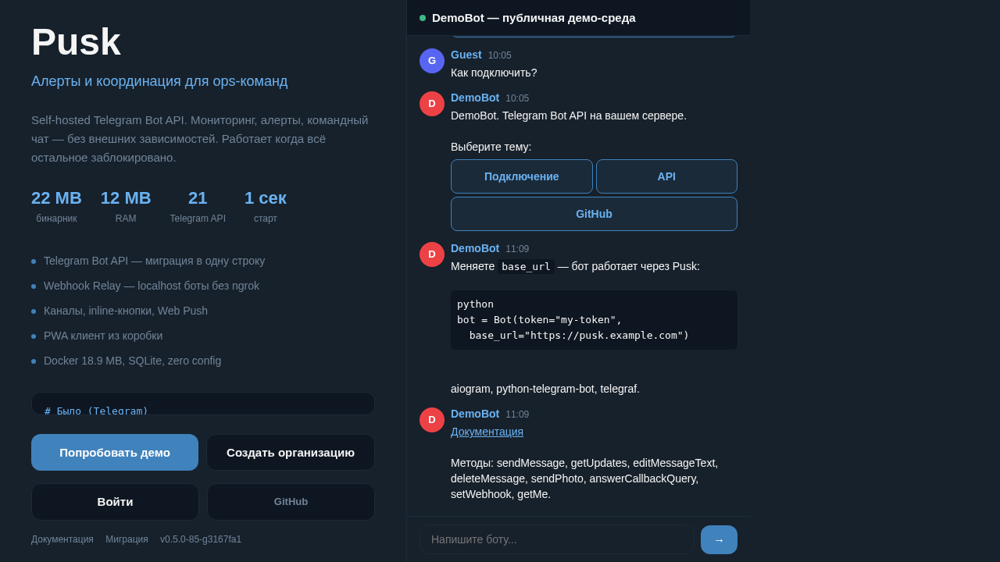

[](LICENSE)
[](https://go.dev)
[](https://github.com/getpusk/pusk)
[](https://core.telegram.org/bots/api)
[](https://www.sqlite.org)
[](https://github.com/getpusk/pusk/pkgs/container/pusk)




> **Self-hosted alert and messaging platform with Telegram Bot API compatibility.**
>
> Alerts, coordination, inline keyboards. One binary, zero config.
> 13 of 80+ Telegram Bot API methods implemented — enough for alerting bots and simple interactions.

**15 MB** binary | **12 MB** RAM | **1s** startup | **SQLite** storage

## Features

- **Telegram Bot API compatible** — sendMessage, editMessageText, deleteMessage, answerCallbackQuery, sendPhoto/Video/Voice/Document, setWebhook
- **InlineKeyboardMarkup** — interactive buttons with callback data
- **PWA client** — dark theme, mobile-ready, WebSocket push
- **File handling** — upload/download photos, voice, video, documents
- **SQLite** — zero-config database, no PostgreSQL/MySQL needed
- **Single binary** — `go build` and run, or use Docker

## Quick Start

```bash
git clone https://github.com/getpusk/pusk.git
cd pusk
go build -o pusk ./cmd/pusk/
./pusk
# Server running at :8443
```

## Docker

```bash
# Quick start
docker run -d --name pusk -p 8443:8443 -v pusk-data:/app/data ghcr.io/getpusk/pusk:latest

# With environment variables
docker run -d --name pusk \
  -p 8443:8443 \
  -v pusk-data:/app/data \
  -e PUSK_DEMO=1 \
  -e PUSK_ADMIN_TOKEN=your-secret \
  -e VAPID_PUBLIC_KEY=... \
  -e VAPID_PRIVATE_KEY=... \
  -e VAPID_EMAIL=admin@example.com \
  ghcr.io/getpusk/pusk:latest
```

### Docker Compose

```yaml
version: '3'
services:
  pusk:
    image: ghcr.io/getpusk/pusk:latest
    ports:
      - "8443:8443"
    volumes:
      - ./data:/app/data
    environment:
      - PUSK_ADMIN_TOKEN=your-secret
    restart: unless-stopped
```

## Self-hosted (VPS)

### Build from source

```bash
git clone https://github.com/getpusk/pusk.git
cd pusk
go build -o pusk ./cmd/pusk/
```

### Systemd service

```bash
sudo tee /etc/systemd/system/pusk.service << EOF
[Unit]
Description=Pusk Alert Platform
After=network.target

[Service]
User=pusk
WorkingDirectory=/opt/pusk
ExecStart=/opt/pusk/pusk
Restart=always
RestartSec=5
Environment=PUSK_ADDR=:8443
Environment=PUSK_ADMIN_TOKEN=your-secret

[Install]
WantedBy=multi-user.target
EOF

sudo systemctl enable --now pusk
```

### Reverse proxy (Caddy)

```
pusk.example.com {
    reverse_proxy localhost:8443
}
```

### Reverse proxy (Nginx)

```nginx
server {
    listen 443 ssl;
    server_name pusk.example.com;

    ssl_certificate /etc/letsencrypt/live/pusk.example.com/fullchain.pem;
    ssl_certificate_key /etc/letsencrypt/live/pusk.example.com/privkey.pem;

    location / {
        proxy_pass http://127.0.0.1:8443;
        proxy_http_version 1.1;
        proxy_set_header Upgrade $http_upgrade;
        proxy_set_header Connection "upgrade";
        proxy_set_header Host $host;
        proxy_set_header X-Forwarded-For $proxy_add_x_forwarded_for;
        proxy_set_header X-Forwarded-Proto $scheme;
    }
}
```

## Upgrading

### Docker

```bash
docker pull ghcr.io/getpusk/pusk:latest
docker stop pusk && docker rm pusk
docker run -d --name pusk -p 8443:8443 -v pusk-data:/app/data ghcr.io/getpusk/pusk:latest
```

### Binary

```bash
# 1. Build new version
cd pusk && git pull && go build -o pusk-new ./cmd/pusk/

# 2. Replace binary (zero-downtime)
mv pusk-new /opt/pusk/pusk
systemctl restart pusk
```

Database migrations run automatically on startup. No manual steps needed.
SQLite schema versioning via `PRAGMA user_version` ensures safe upgrades.

## Backup & Restore

All data is in `data/` directory:
- `data/orgs/*/pusk.db` — SQLite databases (one per organization)
- `data/files/` — uploaded files
- `data/jwt.secret` — JWT signing key

### Backup

```bash
# Stop for consistent backup (or use SQLite online backup)
systemctl stop pusk
cp -r data/ backup-$(date +%Y%m%d)/
systemctl start pusk

# Or hot backup with SQLite CLI
sqlite3 data/orgs/default/pusk.db ".backup backup.db"
```

### Restore

```bash
systemctl stop pusk
rm -rf data/
cp -r backup-20260323/ data/
systemctl start pusk
```

### Automated backup (cron)

```bash
# Daily backup at 3 AM
0 3 * * * cd /opt/pusk && tar czf /backup/pusk-$(date +\%Y\%m\%d).tar.gz data/
```

## Usage

### 1. Register a bot

```bash
curl -X POST http://localhost:8443/admin/bots \
  -H "Content-Type: application/json" \
  -d '{"token":"my-secret-token","name":"MyBot"}'
```

### 2. Set webhook

```bash
curl -X POST http://localhost:8443/bot/my-secret-token/setWebhook \
  -H "Content-Type: application/json" \
  -d '{"url":"http://my-bot-server:3000/webhook"}'
```

### 3. Send message with buttons

```bash
curl -X POST http://localhost:8443/bot/my-secret-token/sendMessage \
  -H "Content-Type: application/json" \
  -d '{"chat_id":1,"text":"Choose:","reply_markup":{"inline_keyboard":[[{"text":"Status","callback_data":"status"},{"text":"Restart","callback_data":"restart"}]]}}'
```

### 4. Open PWA

Navigate to `http://localhost:8443` — register, pick a bot, chat.

## Bot API Compatibility

Pusk implements **13 of 80+ Telegram Bot API methods** — the core subset used by alerting bots, notification pipelines, and simple interactive bots. Methods like `sendMessage`, `sendPhoto`, inline keyboards, and webhooks work identically to Telegram. Advanced features (groups, stickers, payments, games, etc.) are not implemented.

| Telegram Method | Pusk | Notes |
|----------------|------|-------|
| sendMessage | Yes | + InlineKeyboardMarkup |
| editMessageText | Yes | + update keyboard |
| deleteMessage | Yes | |
| answerCallbackQuery | Yes | |
| sendPhoto | Yes | multipart upload |
| sendVideo | Yes | multipart upload |
| sendVoice | Yes | multipart upload |
| sendDocument | Yes | multipart upload |
| setWebhook | Yes | |
| deleteWebhook | Yes | |
| getWebhookInfo | Yes | |
| getUpdates | Yes | long polling |
| getMe | Yes | |

**Not implemented:** sendAnimation, sendSticker, sendLocation, sendContact, sendPoll, forwardMessage, copyMessage, banChatMember, group management, payments, games, passport, and other advanced Telegram methods.

## Configuration

| Env Variable | Default | Description |
|-------------|---------|-------------|
| PUSK_ADDR | :8443 | Listen address |
| PUSK_ADMIN_TOKEN | _(empty)_ | Admin API bearer token |
| PUSK_JWT_SECRET | _(auto-generated)_ | JWT signing key (32+ chars) |
| PUSK_DEMO | _(empty)_ | Set to `1` to enable demo mode with sample data |
| PUSK_LOG_FORMAT | text | `json` for structured JSON logs |
| PUSK_MSG_RETENTION_DAYS | 30 | Auto-delete channel messages older than N days. `0` to disable |
| PUSK_FILE_QUOTA_MB | 1024 | Max file storage per org (MB) |
| PUSK_WEBHOOK_DEBOUNCE | 10s | Dedup window for identical webhooks. `0` to disable |
| PUSK_ALERTMANAGER_URL | _(empty)_ | Alertmanager API URL for auto-silence on ACK |
| VAPID_PUBLIC_KEY | _(empty)_ | VAPID public key for Web Push |
| VAPID_PRIVATE_KEY | _(empty)_ | VAPID private key for Web Push |
| VAPID_EMAIL | _(empty)_ | Contact email for push service |

## Architecture

```
pusk (15 MB binary)
+-- Bot API (/bot/<token>/<method>)  <- Telegram-compatible
+-- Client API (/api/*)              <- PWA backend
+-- WebSocket (/api/ws)              <- real-time push
+-- File server (/file/<id>)         <- media files
+-- PWA (/)                          <- built-in web client
+-- SQLite (data/orgs/*/pusk.db)            <- zero-config storage
```

## Using with Telegram Bot Libraries

If your bot only uses the 13 methods listed above, you can point it at Pusk by changing the base URL. The JSON format for sendMessage, InlineKeyboardMarkup, CallbackQuery is identical to Telegram. Bots that rely on unsupported methods will need adaptation.

### Python (aiogram)
```diff
- bot = Bot(token="YOUR_TOKEN")
+ bot = Bot(token="YOUR_TOKEN", base_url="https://your-pusk:8443/bot")
```

### Python (python-telegram-bot)
```diff
  app = Application.builder().token(TOKEN)
+     .base_url("https://your-pusk:8443/bot")
      .build()
```

### Node.js (Telegraf)
```diff
  const bot = new Telegraf(TOKEN);
+ bot.telegram.options.apiRoot = "https://your-pusk:8443";
```

See [examples/](examples/) for complete working bots.

## Live Demo

Try it: [getpusk.ru](https://getpusk.ru) — click "Demo", no registration needed.

## Integrations

### Uptime Kuma
1. Notifications → Add → Type: **Webhook**
2. URL: `https://your-pusk/hook/BOT-TOKEN?format=raw&channel=alerts`
3. Method: POST, Content-Type: application/json

### Alertmanager
```yaml
receivers:
  - name: pusk
    webhook_configs:
      - url: 'https://your-pusk/hook/BOT-TOKEN?format=alertmanager'
```

### Zabbix
1. Administration → Media types → Create: **Webhook**
2. URL: `https://your-pusk/hook/BOT-TOKEN?format=zabbix`
3. Parameters: `{ALERT.SUBJECT}`, `{ALERT.MESSAGE}`, `{EVENT.SEVERITY}`

### Grafana
1. Alerting → Contact points → New → Type: **Webhook**
2. URL: `https://your-pusk/hook/BOT-TOKEN?format=grafana`

### Any system with Telegram support
If the system has a built-in "Telegram" notification type:
1. Bot Token: your Pusk bot token
2. Chat ID: use **negative channel ID** (e.g., `-2` for channel with ID 2)
3. API URL: `https://your-pusk` (if the system supports custom base URL)

### Generic webhook
```bash
curl -X POST https://your-pusk/hook/BOT-TOKEN?format=raw \
  -H 'Content-Type: application/json' \
  -d '{"status":"down","name":"my-service"}'
```

## Security

- **CSP** headers on all responses (`script-src 'self'`)
- **bcrypt** password hashing
- **JWT** with configurable secret and 7-day TTL
- **Rate limiting** on auth, registration, and message endpoints
- **SSRF protection** on webhook URLs
- **Multi-tenant isolation** — separate SQLite per organization
- **File access** requires JWT or short-lived file tokens

Report vulnerabilities: create a GitHub issue or email the maintainer.

## License

BSL 1.1 - Copyright (c) 2026 Volkov Pavel | DevITWay

See [LICENSE](LICENSE) for details.
