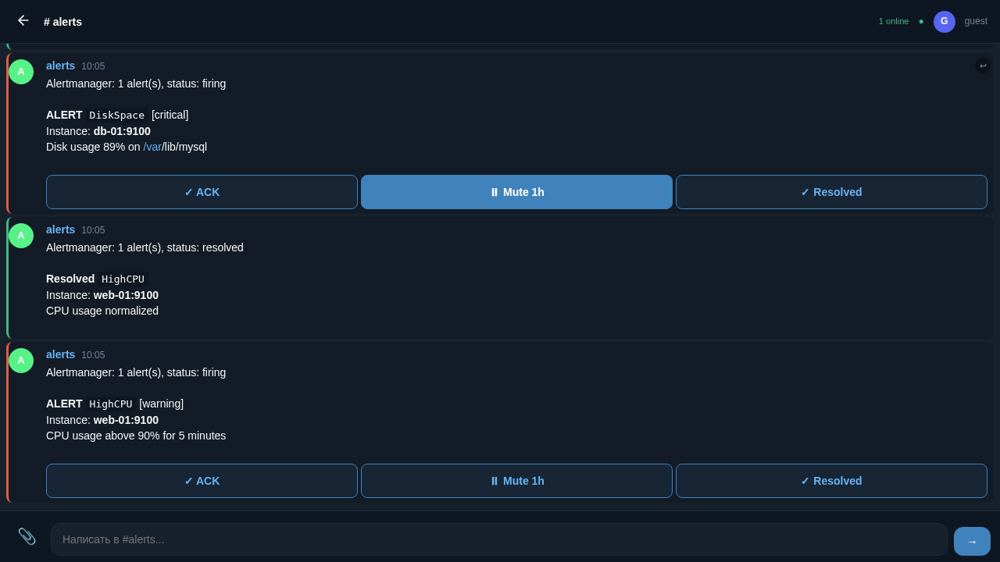
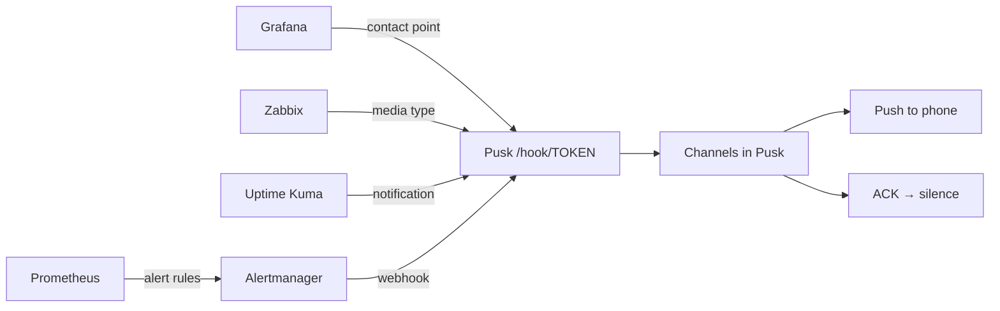
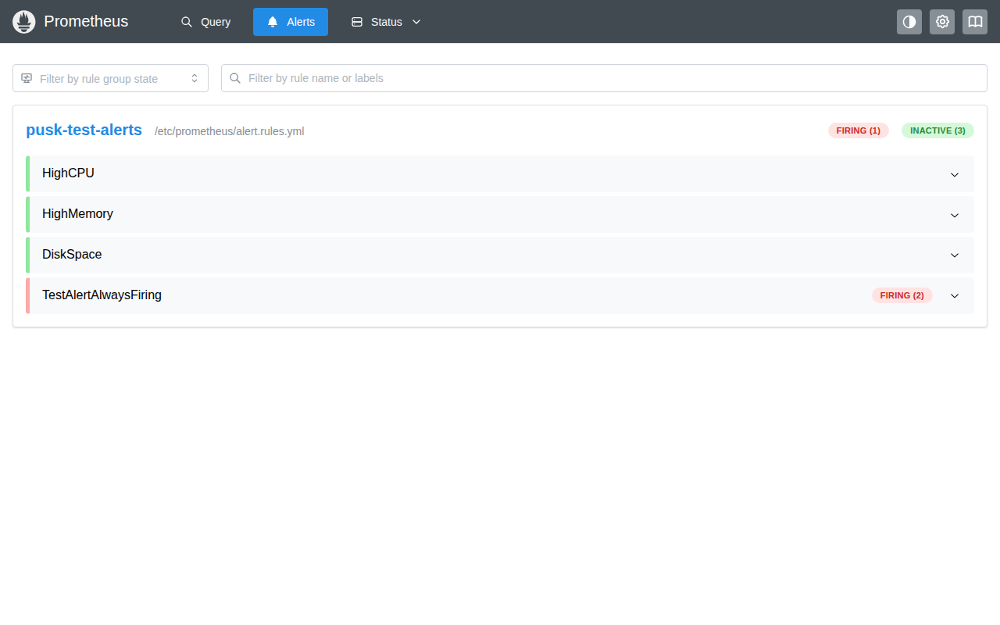
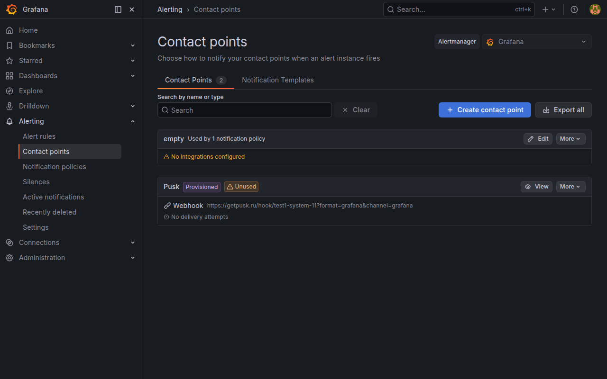
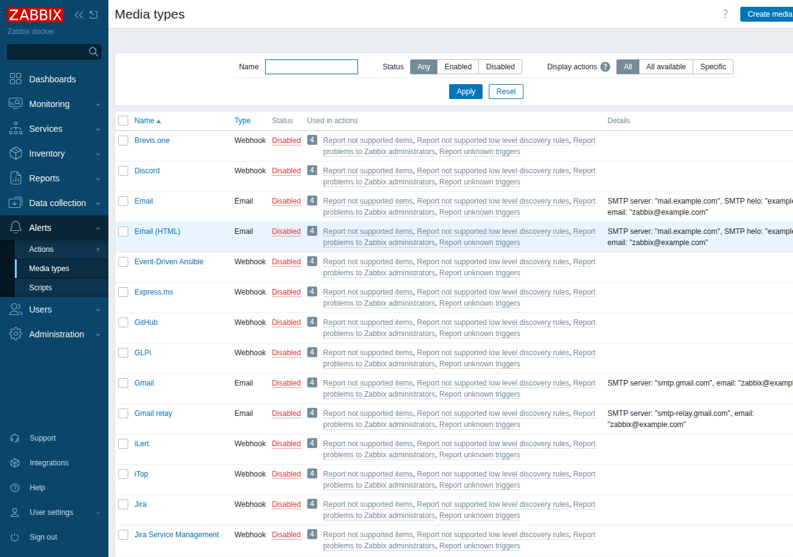
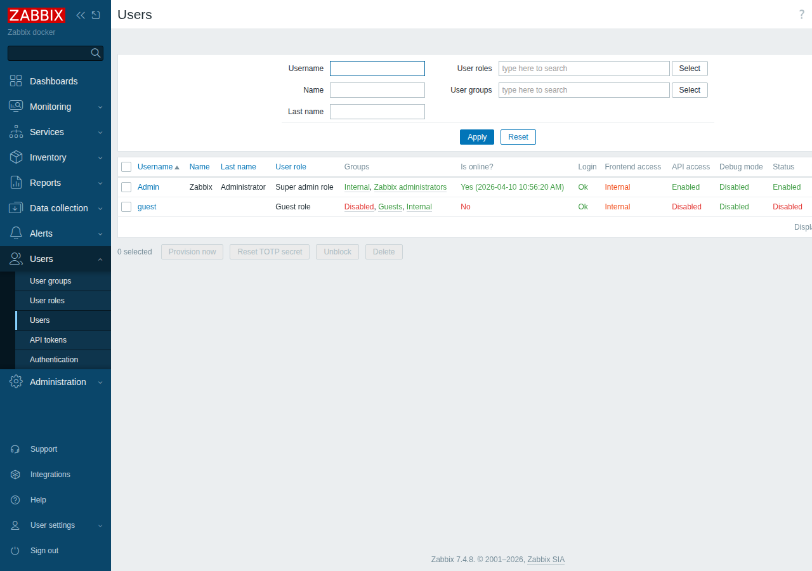
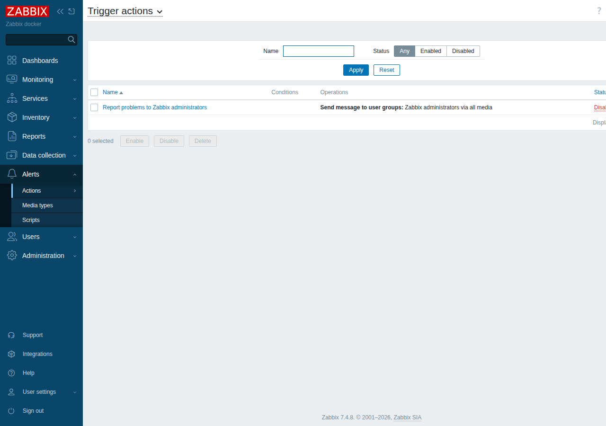
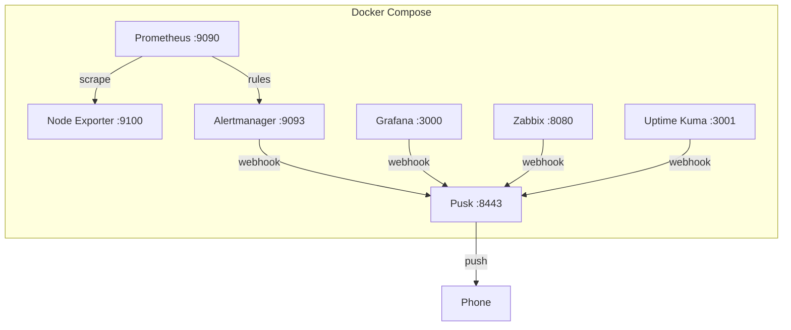

🌐 [Русский](use-cases.md)

# Use Cases: connect monitoring to Pusk in 5 minutes

> For those who just want it to work. Copy, paste, run.



## Contents

| Use case | You have | Time |
|----------|----------|------|
| [Alertmanager](#-alertmanager) | Prometheus + Alertmanager | 5 min |
| [Grafana](#-grafana) | Grafana with alerts | 5 min |
| [Zabbix](#-zabbix) | Zabbix | 5 min |
| [Uptime Kuma](#-uptime-kuma) | Uptime Kuma | 3 min |
| [All-in-one](#-all-in-one) | Nothing, want to try everything | 5 min |

## How it works



Any system that can send a webhook connects to Pusk with a single line.

---

## 🔴 Alertmanager

**Scenario:** you have Prometheus + Alertmanager, alerts go to Telegram or email. You want ACK, push and team chat.

### 1. Download compose files

```bash
mkdir pusk-alertmanager && cd pusk-alertmanager
curl -O https://raw.githubusercontent.com/getpusk/pusk/main/docs/use-cases/alertmanager/docker-compose.yml
curl -O https://raw.githubusercontent.com/getpusk/pusk/main/docs/use-cases/alertmanager/alertmanager.yml
curl -O https://raw.githubusercontent.com/getpusk/pusk/main/docs/use-cases/alertmanager/prometheus.yml
curl -O https://raw.githubusercontent.com/getpusk/pusk/main/docs/use-cases/alertmanager/alert.rules.yml
```

### 2. Start

```bash
docker compose up -d
```

### 3. Set up Pusk

1. Open **http://localhost:8443** — create an organization and account
2. Go to **Settings** → **Bots** → **Create bot** (e.g. `alertmanager`)
3. Copy the **bot token**
4. Create a **channel** `alerts` and assign the bot to it

### 4. Connect Alertmanager

Edit `alertmanager.yml` — replace `BOT-TOKEN` with the token from step 3:

```yaml
receivers:
  - name: pusk
    webhook_configs:
      - url: 'http://pusk:8443/hook/BOT-TOKEN?format=alertmanager&channel=alerts'
        send_resolved: true
```

Restart:

```bash
docker compose restart alertmanager
```

### 5. Done

In 30 seconds a test alert will appear in the `alerts` channel. Click **ACK** — Alertmanager will automatically receive a silence.

Here is what alerts look like in Prometheus — TestAlert is already FIRING:



And here is how they appear in Pusk:


> **Connecting to an existing Alertmanager:** add a `pusk` receiver to your `alertmanager.yml` and configure the route. Pusk does not have to be in the same compose.

---

## 🟡 Grafana

**Scenario:** you have Grafana with configured alerts, notifications go to email/Slack. You want push and ACK.

### 1. Download compose file

```bash
mkdir pusk-grafana && cd pusk-grafana
curl -O https://raw.githubusercontent.com/getpusk/pusk/main/docs/use-cases/grafana/docker-compose.yml
```

### 2. Start

```bash
docker compose up -d
```

### 3. Set up Pusk

1. Open **http://localhost:8443** — create an organization and account
2. **Settings** → **Bots** → create a bot `grafana`
3. Copy the **token**, create a **channel** `grafana-alerts`, assign the bot

### 4. Configure Grafana

1. Open **http://localhost:3000** (admin / admin)
2. **Alerting** → **Contact points** → **Add contact point**
3. Name: `Pusk`
4. Integration: **Webhook**
5. URL: `http://pusk:8443/hook/BOT-TOKEN?format=grafana&channel=grafana-alerts`
6. **Save & test** — click **Send test notification**

Here is a configured "Pusk" Contact Point in Grafana:



### 5. Assign policy

1. **Alerting** → **Notification policies**
2. Change **Default contact point** to `Pusk` (or create a separate policy)

### 6. Done

All Grafana alerts now arrive in Pusk with push to phone.

> **Connecting to an existing Grafana:** just add a Contact Point of type Webhook. URL: `https://your-pusk/hook/BOT-TOKEN?format=grafana&channel=grafana-alerts`

---

## 🟢 Zabbix

**Scenario:** you have Zabbix, notifications go via email/Telegram/SMS. You want all alerts in one place with push to phone.

In Zabbix you need to do 3 things: create a Media Type (delivery method), assign it to a user, and create an Action (rule for "when to send"). Below — every step click by click.

### 1. Download compose file

```bash
mkdir pusk-zabbix && cd pusk-zabbix
curl -O https://raw.githubusercontent.com/getpusk/pusk/main/docs/use-cases/zabbix/docker-compose.yml
```

### 2. Start

```bash
docker compose up -d
```

Zabbix takes ~30 seconds to start. Wait until `zabbix-web` shows `healthy`:

```bash
docker compose ps
```

### 3. Set up Pusk

1. Open **http://localhost:8443** — create an organization and account
2. **Settings** (gear icon at the bottom) → **Bots** → **Create bot**
3. Bot name: `zabbix` → click **Create**
4. Copy the **bot token** (looks like `zabbix-myorg-42`) — you will need it below
5. Create a **channel** `zabbix-alerts`
6. Assign bot `zabbix` to channel `zabbix-alerts`

### 4. Create Media Type (Step 1 of 3)

This is the "delivery method" — how Zabbix will send alerts to Pusk.

1. Open **http://localhost:8080** → login **Admin** / password **zabbix**
2. In the left menu find **Alerts** → click it → sub-items will expand
3. Click **Media types**



4. Click **Create media type** button (top right)
5. Fill in the form:

   **Name:**
   ```
   Pusk
   ```

   **Type:** select **Webhook** from the dropdown

6. After selecting Webhook, a **Parameters** section appears. Remove all default parameters and add three new ones (click **Add**):

   | Name | Value |
   |------|-------|
   | `url` | `http://pusk:8443/hook/YOUR-TOKEN?format=zabbix&channel=zabbix-alerts` |
   | `subject` | `{ALERT.SUBJECT}` |
   | `message` | `{ALERT.MESSAGE}` |

   > Replace `YOUR-TOKEN` with the bot token from step 3.

7. In the **Script** field paste this code (copy it entirely):

   ```javascript
   var params = JSON.parse(value);
   var req = new HttpRequest();
   req.addHeader('Content-Type: application/json');
   var data = JSON.stringify({
       subject: params.subject,
       message: params.message
   });
   var resp = req.post(params.url, data);
   return resp;
   ```

8. Click **Add** (bottom of the page) to save the Media Type

#### Verify

On the Media types page find the `Pusk` row, click **Test** in the right column. In the popup enter:
- subject: `Test alert from Zabbix`
- message: `Hello from Zabbix!`

Click **Test** → you should see `Response: OK`. Open Pusk — the message will appear in the `zabbix-alerts` channel.

### 5. Assign Media to a user (Step 2 of 3)

Zabbix sends notifications to specific users, not directly. You need to "assign" Pusk to the Admin user.

1. In the left menu click **Users** → **Users**



2. Click on **Admin** (blue link in the table)
3. The user edit form opens. Find the **Media** tab (at the top of the form, next to "User" and "Permissions")
4. Click the **Media** tab
5. Click **Add** button (below the media table)
6. In the popup fill in:
   - **Type:** select `Pusk` (the Media Type you created in step 4)
   - **Send to:** enter `pusk` (any value, Zabbix requires it but the webhook ignores it)
   - **When active:** leave `1-7,00:00-24:00` (24/7)
   - **Use if severity:** check all boxes (or only the levels you need)
   - **Enabled:** must be checked
7. Click **Add** in the popup
8. Click **Update** at the bottom of the user page

### 6. Create an Action (Step 3 of 3)

An Action is a rule: "when a trigger fires — send a notification via Pusk".

1. In the left menu click **Alerts** → **Actions** → sub-menu opens
2. Click **Trigger actions**



3. Click **Create action** button (top right)
4. On the **Action** tab:
   - **Name:** `Send to Pusk`
   - **Conditions:** leave empty (= all triggers). Or add a filter for specific ones
5. Switch to the **Operations** tab
6. In the **Operations** section click **Add** and fill in:
   - **Send to users:** click **Add**, select `Admin` → click **Select**
   - **Send only to:** select `Pusk`
7. Click **Add** in the operation popup
8. *(Optional)* In **Recovery operations** add an operation too — to get notified when the problem is resolved:
   - **Add** → Send to users: `Admin`, Send only to: `Pusk`
9. Click **Add** at the bottom of the page

### 7. Done

The chain now works:

```
Trigger fires → Action "Send to Pusk" → Media Type "Pusk" (Webhook) → Pusk channel zabbix-alerts → Push to phone
```

When any Zabbix trigger fires, the alert will appear in Pusk.

#### Not working? Check

1. **Media Type is disabled** — on the Media types page the status should be **Enabled** (green)
2. **Action is disabled** — on the Trigger actions page the status should be **Enabled**
3. **Wrong token** — open the URL from the `url` parameter in your browser, you should see `{"ok":true}`
4. **Pusk is unreachable from Zabbix** — if Pusk is on another server, replace `http://pusk:8443` with the external address
5. **Zabbix logs** — `docker compose logs zabbix-server` will show send errors

> **Connecting to an existing Zabbix:** you do not need the compose file. Just follow steps 4-6 in your Zabbix, replacing `http://pusk:8443` with your Pusk server address.

---

## 🟣 Uptime Kuma

**Scenario:** you have Uptime Kuma for website uptime monitoring. You want push to phone when a site goes down.

### 1. Download compose file

```bash
mkdir pusk-uptime-kuma && cd pusk-uptime-kuma
curl -O https://raw.githubusercontent.com/getpusk/pusk/main/docs/use-cases/uptime-kuma/docker-compose.yml
```

### 2. Start

```bash
docker compose up -d
```

### 3. Set up Pusk

1. Open **http://localhost:8443** — create an organization and account
2. **Settings** → **Bots** → create a bot `uptime-kuma`
3. Copy the **token**, create a **channel** `uptime`, assign the bot

### 4. Configure Uptime Kuma

1. Open **http://localhost:3001** — create an account
2. **Settings** (gear icon) → **Notifications** → **Setup Notification**
3. Notification Type: **Webhook**
4. Friendly Name: `Pusk`
5. URL: `http://pusk:8443/hook/BOT-TOKEN?format=raw&channel=uptime`
6. Request Body: **Auto**
7. **Test** → a message should appear in Pusk

### 5. Add a monitor

1. **Add New Monitor** → HTTP(s), enter the site URL
2. In the **Notifications** section enable `Pusk`
3. **Save**

### 6. Done

When a site goes down — alert in Pusk + push to phone. When it comes back — resolve.

> **Connecting to an existing Uptime Kuma:** just add a Webhook notification. Enable it on the monitors you need.

---

## 🚀 All-in-one

**Scenario:** you want to try Pusk with all alert sources in a single `docker compose up`.

### 1. Download

```bash
mkdir pusk-full && cd pusk-full
curl -O https://raw.githubusercontent.com/getpusk/pusk/main/docs/use-cases/all-in-one/docker-compose.yml
curl -O https://raw.githubusercontent.com/getpusk/pusk/main/docs/use-cases/all-in-one/alertmanager.yml
curl -O https://raw.githubusercontent.com/getpusk/pusk/main/docs/use-cases/all-in-one/prometheus.yml
curl -O https://raw.githubusercontent.com/getpusk/pusk/main/docs/use-cases/all-in-one/alert.rules.yml
```

### 2. Start

```bash
docker compose up -d
```

### 3. What comes up

| Service | URL | Login |
|---------|-----|-------|
| **Pusk** | http://localhost:8443 | create on first visit |
| **Grafana** | http://localhost:3000 | admin / admin |
| **Prometheus** | http://localhost:9090 | — |
| **Alertmanager** | http://localhost:9093 | — |
| **Zabbix** | http://localhost:8080 | Admin / zabbix |
| **Uptime Kuma** | http://localhost:3001 | create on first visit |

### 4. Configure

1. Open Pusk → create an organization
2. Create bots: `alertmanager`, `grafana`, `zabbix`, `uptime-kuma`
3. Create channels and assign bots
4. Put the tokens into each system's config (see use cases above)

In a minute alerts will flow from all sides.



---

## FAQ

<details>
<summary><b>Where do I get BOT-TOKEN?</b></summary>

In Pusk: **Settings** → **Bots** → **Create bot** → the token looks like `test1-system-11`. It is also visible on the bot card.
</details>

<details>
<summary><b>My monitoring is on a different server. How do I connect?</b></summary>

Replace `http://pusk:8443` with the external address of your Pusk server (e.g. `https://pusk.example.com`). The Docker network `pusk-net` is only needed for compose examples.
</details>

<details>
<summary><b>How do I get push on my phone?</b></summary>

1. Open Pusk in Chrome on your phone
2. The browser will ask permission for notifications — allow it
3. You can add it to your home screen (PWA) — but it is optional
</details>

<details>
<summary><b>How does ACK work?</b></summary>

Click the **ACK** button on an alert in Pusk. If the `PUSK_ALERTMANAGER_URL` variable is set, Pusk will automatically create a silence in Alertmanager for that alert.
</details>

<details>
<summary><b>Can I connect multiple systems at once?</b></summary>

Yes. Create a separate bot and channel for each source. This way alerts will not mix.
</details>

<details>
<summary><b>What if I have a custom monitoring system / script?</b></summary>

Send a POST to `/hook/BOT-TOKEN?format=raw`:

```bash
curl -X POST 'http://your-pusk:8443/hook/BOT-TOKEN?format=raw' \
  -H 'Content-Type: application/json' \
  -d '{"text": "Server db-01 is not responding"}'
```
</details>

---

[Back to README](../../README.en.md) | [Live demo — no registration](https://getpusk.ru)
