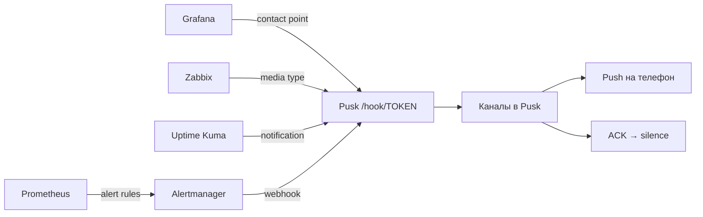
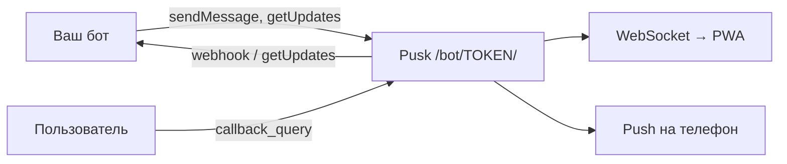
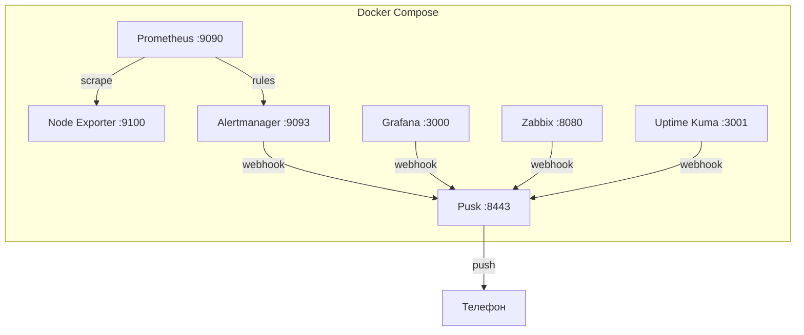

🌐 [English](use-cases.en.md)

# Кейсы: подключи мониторинг к Pusk за 5 минут

> Для тех, кому лень читать документацию. Копируй, вставляй, запускай.


## Содержание

| Кейс | У вас есть | Время |
|------|-----------|-------|
| [Alertmanager](#-alertmanager) | Prometheus + Alertmanager | 5 мин |
| [Grafana](#-grafana) | Grafana с алертами | 5 мин |
| [Zabbix](#-zabbix) | Zabbix | 5 мин |
| [Uptime Kuma](#-uptime-kuma) | Uptime Kuma | 3 мин |
| [Telegram Bot API](#-telegram-bot-api) | Telegram-бот на Python/Node.js/Go | 2 мин |
| [Всё сразу](#-всё-сразу) | Ничего, хочу попробовать | 5 мин |

## Как это работает



Любая система, которая умеет отправлять webhook, подключается к Pusk одной строкой.

---

## 🔴 Alertmanager

**Сценарий:** у вас Prometheus + Alertmanager, алерты летят в Telegram или email. Хотите ACK, push и командный чат.

### 1. Скачайте compose-файл

```bash
mkdir pusk-alertmanager && cd pusk-alertmanager
curl -O https://raw.githubusercontent.com/getpusk/pusk/main/docs/use-cases/alertmanager/docker-compose.yml
curl -O https://raw.githubusercontent.com/getpusk/pusk/main/docs/use-cases/alertmanager/alertmanager.yml
curl -O https://raw.githubusercontent.com/getpusk/pusk/main/docs/use-cases/alertmanager/prometheus.yml
curl -O https://raw.githubusercontent.com/getpusk/pusk/main/docs/use-cases/alertmanager/alert.rules.yml
```

### 2. Запустите

```bash
docker compose up -d
```

### 3. Настройте Pusk

1. Откройте **http://localhost:8443** — создайте организацию и аккаунт
2. Перейдите в **Настройки** → **Боты** → **Создать бота** (например, `alertmanager`)
3. Скопируйте **токен бота**
4. Создайте **канал** `alerts` и назначьте бота на канал

### 4. Подключите Alertmanager

Отредактируйте `alertmanager.yml` — замените `BOT-TOKEN` на токен из шага 3:

```yaml
receivers:
  - name: pusk
    webhook_configs:
      - url: 'http://pusk:8443/hook/BOT-TOKEN?format=alertmanager&channel=alerts'
        send_resolved: true
```

Перезапустите:

```bash
docker compose restart alertmanager
```

### 5. Готово

Через 30 секунд тестовый алерт появится в канале `alerts`. Нажмите **ACK** — Alertmanager автоматически получит silence.

Вот как выглядят алерты в Prometheus — TestAlert уже FIRING:


А вот как они приходят в Pusk:


> **Подключение к существующему Alertmanager:** добавьте receiver `pusk` в ваш `alertmanager.yml` и пропишите route. Pusk не обязательно поднимать в том же compose.

---

## 🟡 Grafana

**Сценарий:** у вас Grafana с настроенными алертами, уведомления идут в email/Slack. Хотите push и ACK.

### 1. Скачайте compose-файл

```bash
mkdir pusk-grafana && cd pusk-grafana
curl -O https://raw.githubusercontent.com/getpusk/pusk/main/docs/use-cases/grafana/docker-compose.yml
```

### 2. Запустите

```bash
docker compose up -d
```

### 3. Настройте Pusk

1. Откройте **http://localhost:8443** — создайте организацию и аккаунт
2. **Настройки** → **Боты** → создайте бота `grafana`
3. Скопируйте **токен**, создайте **канал** `grafana-alerts`, назначьте бота

### 4. Настройте Grafana

1. Откройте **http://localhost:3000** (admin / admin)
2. **Alerting** → **Contact points** → **Add contact point**
3. Name: `Pusk`
4. Integration: **Webhook**
5. URL: `http://pusk:8443/hook/BOT-TOKEN?format=grafana&channel=grafana-alerts`
6. **Save & test** — нажмите **Send test notification**

Вот как выглядит настроенный Contact Point «Pusk» в Grafana:


### 5. Назначьте политику

1. **Alerting** → **Notification policies**
2. Измените **Default contact point** на `Pusk` (или создайте отдельную policy)

### 6. Готово

Все алерты Grafana теперь приходят в Pusk с push на телефон.

> **Подключение к существующей Grafana:** просто добавьте Contact Point типа Webhook. URL: `https://your-pusk/hook/BOT-TOKEN?format=grafana&channel=grafana-alerts`

---

## 🟢 Zabbix

**Сценарий:** у вас Zabbix, уведомления через email/Telegram/SMS. Хотите собрать алерты в одном месте с push на телефон.

В Zabbix нужно сделать 3 вещи: создать Media Type (способ отправки), привязать его к пользователю, и создать Action (правило «когда отправлять»). Ниже — каждый шаг по клику.

### 1. Скачайте compose-файл

```bash
mkdir pusk-zabbix && cd pusk-zabbix
curl -O https://raw.githubusercontent.com/getpusk/pusk/main/docs/use-cases/zabbix/docker-compose.yml
```

### 2. Запустите

```bash
docker compose up -d
```

Zabbix стартует ~30 секунд. Дождитесь, пока `zabbix-web` покажет `healthy`:

```bash
docker compose ps
```

### 3. Настройте Pusk

1. Откройте **http://localhost:8443** — создайте организацию и аккаунт
2. **Настройки** (шестерёнка внизу) → **Боты** → **Создать бота**
3. Имя бота: `zabbix` → нажмите **Создать**
4. Скопируйте **токен бота** (он выглядит как `zabbix-myorg-42`) — он понадобится дальше
5. Создайте **канал** `zabbix-alerts`
6. Назначьте бота `zabbix` на канал `zabbix-alerts`

### 4. Создайте Media Type (Шаг 1 из 3)

Это «способ доставки» — как Zabbix будет отправлять алерты в Pusk.

1. Откройте **http://localhost:8080** → логин **Admin** / пароль **zabbix**
2. В левом меню найдите раздел **Alerts** → нажмите на него → откроются подпункты
3. Нажмите **Media types**


4. Нажмите кнопку **Create media type** (справа вверху)
5. Заполните форму:

   **Name:**
   ```
   Pusk
   ```

   **Type:** выберите **Webhook** из выпадающего списка

6. После выбора Webhook появится секция **Parameters**. Удалите все параметры, которые там есть по умолчанию, и добавьте три новых (кнопка **Add**):

   | Name | Value |
   |------|-------|
   | `url` | `http://pusk:8443/hook/ВСТАВЬТЕ-ТОКЕН?format=zabbix&channel=zabbix-alerts` |
   | `subject` | `{ALERT.SUBJECT}` |
   | `message` | `{ALERT.MESSAGE}` |

   > Замените `ВСТАВЬТЕ-ТОКЕН` на токен бота из шага 3.

7. В поле **Script** вставьте этот код (скопируйте целиком):

   ```javascript
   var params = JSON.parse(value);
   var req = new HttpRequest();
   req.addHeader('Content-Type: application/json');
   var data = JSON.stringify({
       subject: params.subject,
       message: params.message
   });
   var resp = req.post(params.url, data);
   return resp;
   ```

8. Нажмите **Add** (внизу страницы) чтобы сохранить Media Type

#### Проверка

На странице Media types найдите строку `Pusk`, нажмите **Test** в правом столбце. В появившемся окне введите:
- subject: `Test alert from Zabbix`
- message: `Hello from Zabbix!`

Нажмите **Test** → должно появиться `Response: OK`. Откройте Pusk — сообщение появится в канале `zabbix-alerts`.

### 5. Привяжите Media к пользователю (Шаг 2 из 3)

Zabbix отправляет уведомления не напрямую, а конкретным пользователям. Нужно «привязать» Pusk к пользователю Admin.

1. В левом меню нажмите **Users** → **Users**


2. Нажмите на имя **Admin** (синяя ссылка в таблице)
3. Откроется форма редактирования пользователя. Найдите вкладку **Media** (вверху формы, рядом с «User» и «Permissions»)
4. Нажмите вкладку **Media**
5. Нажмите кнопку **Add** (под таблицей медиа)
6. В появившемся окне заполните:
   - **Type:** выберите `Pusk` (тот Media Type, который создали в шаге 4)
   - **Send to:** введите `pusk` (любое значение, Zabbix требует заполнить, но webhook его игнорирует)
   - **When active:** оставьте `1-7,00:00-24:00` (круглосуточно)
   - **Use if severity:** отметьте все галочки (или только нужные уровни)
   - **Enabled:** должно быть включено (галочка)
7. Нажмите **Add** в окне
8. Нажмите **Update** внизу страницы пользователя

### 6. Создайте Action (Шаг 3 из 3)

Action — это правило «когда сработает триггер — отправь уведомление через Pusk».

1. В левом меню нажмите **Alerts** → **Actions** → откроется подменю
2. Нажмите **Trigger actions**


3. Нажмите кнопку **Create action** (справа вверху)
4. На вкладке **Action**:
   - **Name:** `Send to Pusk`
   - **Conditions:** оставьте пустым (= все триггеры). Или добавьте фильтр, если хотите только определённые
5. Перейдите на вкладку **Operations**
6. В секции **Operations** нажмите **Add** и заполните:
   - **Send to users:** нажмите **Add**, выберите `Admin` → нажмите **Select**
   - **Send only to:** выберите `Pusk`
7. Нажмите **Add** в окне операции
8. *(Опционально)* В секции **Recovery operations** тоже добавьте операцию — чтобы получать уведомление когда проблема решена:
   - **Add** → Send to users: `Admin`, Send only to: `Pusk`
9. Нажмите **Add** внизу страницы

### 7. Готово

Теперь цепочка работает:

```
Триггер сработал → Action «Send to Pusk» → Media Type «Pusk» (Webhook) → Pusk канал zabbix-alerts → Push на телефон
```

Когда в Zabbix сработает любой триггер, алерт появится в Pusk.

#### Не работает? Проверьте

1. **Media Type отключён** — на странице Media types статус должен быть **Enabled** (зелёный)
2. **Action отключён** — на странице Trigger actions статус должен быть **Enabled**
3. **Токен неправильный** — откройте URL из параметра `url` в браузере, должно быть `{"ok":true}`
4. **Pusk недоступен из Zabbix** — если Pusk на другом сервере, замените `http://pusk:8443` на внешний адрес
5. **Логи Zabbix** — `docker compose logs zabbix-server` покажет ошибки отправки

> **Подключение к существующему Zabbix:** вам не нужен compose-файл. Просто выполните шаги 4-6 в вашем Zabbix, заменив `http://pusk:8443` на адрес вашего Pusk-сервера.

---

## 🟣 Uptime Kuma

**Сценарий:** у вас Uptime Kuma для мониторинга доступности сайтов. Хотите push на телефон когда сайт падает.

### 1. Скачайте compose-файл

```bash
mkdir pusk-uptime-kuma && cd pusk-uptime-kuma
curl -O https://raw.githubusercontent.com/getpusk/pusk/main/docs/use-cases/uptime-kuma/docker-compose.yml
```

### 2. Запустите

```bash
docker compose up -d
```

### 3. Настройте Pusk

1. Откройте **http://localhost:8443** — создайте организацию и аккаунт
2. **Настройки** → **Боты** → создайте бота `uptime-kuma`
3. Скопируйте **токен**, создайте **канал** `uptime`, назначьте бота

### 4. Настройте Uptime Kuma

1. Откройте **http://localhost:3001** — создайте аккаунт
2. **Settings** (шестерёнка) → **Notifications** → **Setup Notification**
3. Notification Type: **Webhook**
4. Friendly Name: `Pusk`
5. URL: `http://pusk:8443/hook/BOT-TOKEN?format=raw&channel=uptime`
6. Request Body: **Auto**
7. **Test** → должно прийти сообщение в Pusk

### 5. Добавьте мониторинг

1. **Add New Monitor** → HTTP(s), введите URL сайта
2. В разделе **Notifications** включите `Pusk`
3. **Save**

### 6. Готово

Когда сайт упадёт — алерт в Pusk + push на телефон. Когда поднимется — resolve.

> **Подключение к существующей Uptime Kuma:** просто добавьте Webhook notification. Включите на нужных мониторах.

---

## 🤖 Telegram Bot API

**Сценарий:** у вас уже есть Telegram-бот (Python, Node.js, Go, curl). Хотите перенести его на self-hosted без зависимости от Telegram.

Pusk реализует Telegram Bot API — тот же формат запросов, ответов и webhook'ов. Ваш существующий бот продолжит работать, если заменить `base_url` с `api.telegram.org` на адрес Pusk.

### Как это работает



### Миграция: aiogram 3.x (Python)

```diff
- bot = Bot(token="YOUR_TOKEN")
+ bot = Bot(token="YOUR_TOKEN", base_url="https://your-pusk:8443/bot")
```

Одна строка. Всё остальное без изменений — handlers, filters, FSM.

### Миграция: python-telegram-bot 21.x

```diff
  app = (
      Application.builder()
      .token(TOKEN)
+     .base_url("https://your-pusk:8443/bot")
+     .base_file_url("https://your-pusk:8443/bot")
      .build()
  )
```

Две строки. `base_file_url` нужен для скачивания файлов через Pusk.

### Миграция: Telegraf 4.x (Node.js)

```diff
  const bot = new Telegraf(TOKEN);
+ bot.telegram.options.apiRoot = 'https://your-pusk:8443';
```

Одна строка.

### Миграция: curl / любой HTTP-клиент

Формат запросов идентичен Telegram Bot API:

```bash
# Отправить сообщение
curl -X POST 'https://your-pusk:8443/bot/BOT-TOKEN/sendMessage' \
  -H 'Content-Type: application/json' \
  -d '{"chat_id": 1, "text": "Сервер db-01 не отвечает"}'

# Отправить в канал по имени (Pusk-эксклюзив)
curl -X POST 'https://your-pusk:8443/bot/BOT-TOKEN/sendChannel' \
  -H 'Content-Type: application/json' \
  -d '{"channel": "alerts", "text": "Диск заполнен на 95%"}'

# Long polling
curl 'https://your-pusk:8443/bot/BOT-TOKEN/getUpdates?timeout=30&offset=0'
```

### Что поддерживается

| Метод | Статус | Заметки |
|-------|--------|---------|
| getUpdates | Full | Long polling, offset |
| setWebhook / deleteWebhook | Full | secret_token |
| sendMessage | Full | HTML, Markdown, reply_to |
| editMessageText | Full | Real-time через WebSocket |
| deleteMessage | Full | |
| sendPhoto / sendDocument / sendVoice / sendVideo | Full | Multipart upload |
| answerCallbackQuery | Full | |
| getMe | Full | |

Полная таблица со всеми методами — в [COMPAT.md](../COMPAT.md).

### Отличия от Telegram

| | Telegram | Pusk |
|-|----------|------|
| update_id | Последовательный на бота | Монотонный (UnixMilli), общий на организацию |
| Файлы | Telegram CDN | Локальное хранилище |
| Chat ID | Отрицательные для групп | Положительные (ID каналов) |
| Создание ботов | @BotFather | Админ-панель Pusk |
| Rate limits | 30 msg/sec | Настраиваемый |

### Pusk-эксклюзивы

Методы, которых нет в Telegram:

- **sendChannel** — отправить сообщение в канал по имени, без chat_id
- **relay** — WebSocket relay для real-time коммуникации бота
- **createChannel** — создать канал через Bot API
- Входящие webhook'и (`/hook/TOKEN`) — Alertmanager, Zabbix, Grafana из коробки

> **Полная совместимость:** если ваш бот использует `sendMessage`, `getUpdates`, inline-кнопки и файлы — он будет работать с Pusk без изменений кроме `base_url`. Подробнее — [COMPAT.md](../COMPAT.md).

---

## 🚀 Всё сразу

**Сценарий:** хотите попробовать Pusk со всеми источниками алертов за один `docker compose up`.

### 1. Скачайте

```bash
mkdir pusk-full && cd pusk-full
curl -O https://raw.githubusercontent.com/getpusk/pusk/main/docs/use-cases/all-in-one/docker-compose.yml
curl -O https://raw.githubusercontent.com/getpusk/pusk/main/docs/use-cases/all-in-one/alertmanager.yml
curl -O https://raw.githubusercontent.com/getpusk/pusk/main/docs/use-cases/all-in-one/prometheus.yml
curl -O https://raw.githubusercontent.com/getpusk/pusk/main/docs/use-cases/all-in-one/alert.rules.yml
```

### 2. Запустите

```bash
docker compose up -d
```

### 3. Что поднимется

| Сервис | URL | Логин |
|--------|-----|-------|
| **Pusk** | http://localhost:8443 | создайте при первом входе |
| **Grafana** | http://localhost:3000 | admin / admin |
| **Prometheus** | http://localhost:9090 | — |
| **Alertmanager** | http://localhost:9093 | — |
| **Zabbix** | http://localhost:8080 | Admin / zabbix |
| **Uptime Kuma** | http://localhost:3001 | создайте при первом входе |

### 4. Настройте

1. Откройте Pusk → создайте организацию
2. Создайте ботов: `alertmanager`, `grafana`, `zabbix`, `uptime-kuma`
3. Создайте каналы и назначьте ботов
4. Подставьте токены в конфиги каждой системы (см. кейсы выше)

Через минуту алерты потекут со всех сторон.



---

## Часто задаваемые вопросы

<details>
<summary><b>Где взять BOT-TOKEN?</b></summary>

В Pusk: **Настройки** → **Боты** → **Создать бота** → токен выглядит как `test1-system-11`. Он же виден на карточке бота.
</details>

<details>
<summary><b>Мой мониторинг на другом сервере. Как подключить?</b></summary>

Замените `http://pusk:8443` на внешний адрес вашего Pusk-сервера (например, `https://pusk.example.com`). Docker network `pusk-net` не нужен — это только для compose-примеров.
</details>

<details>
<summary><b>Как получать push на телефон?</b></summary>

1. Откройте Pusk в Chrome на телефоне
2. Браузер спросит разрешение на уведомления — разрешите
3. Можно добавить на главный экран (PWA) — но это необязательно
</details>

<details>
<summary><b>Как работает ACK?</b></summary>

Нажмите кнопку **ACK** на алерте в Pusk. Если настроена переменная `PUSK_ALERTMANAGER_URL`, Pusk автоматически создаст silence в Alertmanager на этот алерт.
</details>

<details>
<summary><b>Можно ли подключить несколько систем одновременно?</b></summary>

Да. Создайте отдельного бота и канал для каждого источника. Так алерты не смешаются.
</details>

<details>
<summary><b>А если у меня свой мониторинг / скрипт?</b></summary>

Отправьте POST на `/hook/BOT-TOKEN?format=raw`:

```bash
curl -X POST 'http://your-pusk:8443/hook/BOT-TOKEN?format=raw' \
  -H 'Content-Type: application/json' \
  -d '{"text": "Сервер db-01 не отвечает"}'
```
</details>

---

[Назад к README](../../README.md) | [Демо без регистрации](https://getpusk.ru)
